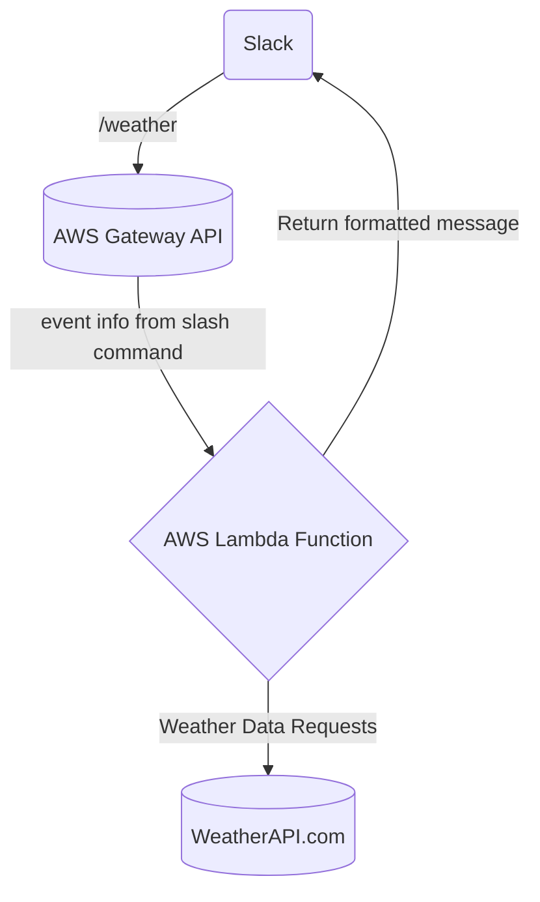

# Python Slack Bot - Built with AWS Lambda
## Usage
- The slash command `/weather` can be used in any channel to fetch weather data. The bot is leveraging https://www.weatherapi.com/ for weather data.
- Current functionality includes
  - weather alerts
  - current conditions
  - current air quality statistics
- Use `/weather help` to display slash command functionality in its entirety

## Demo Videos
1. [/weather help](https://youtu.be/jnVGgDovTSI)
2. [/weather alerts](https://youtu.be/n_evkQKtDpw)
3. [/weather air](https://youtu.be/Wg1HP4oW4gE)
4. [/weather current](https://youtu.be/xbVbOhGUuP4)

## Architecture Graph


# Setup
## Slack App Setup
- Create your own Slack Workspace
- Download Slack and Sign-in
- Head over to https://api.slack.com/ and click 'Create New App'
- Build your slack bot by inputting the following app manifest
```yaml
display_information:
  name: Chat Bot
features:
  bot_user:
    display_name: Chat Bot
    always_online: false
  slash_commands:
    - command: /weather
      url: INSERT_AWS_GATEWAY_API_ENDPOINT
      description: Retrieve weather information
      usage_hint: air location, alerts location, current location
      should_escape: false
oauth_config:
  scopes:
    user:
      - users:read.email
      - users:read
    bot:
      - chat:write
      - channels:read
      - users:read.email
      - users:read
      - im:write
      - im:read
      - im:history
      - commands
settings:
  org_deploy_enabled: false
  socket_mode_enabled: false
  token_rotation_enabled: false
  ```
- Replace `INSERT_AWS_GATEWAY_API_ENDPOINT` with your AWS API Gateway URL

## AWS Setup
- Create an AWS Console account if you don't already have one
- Refer to the python-slack-bot-sam.yaml file for aid in setting up your lambda function
- You will need to create or use an existing KMS Key - http://docs.aws.amazon.com/kms/latest/developerguide/create-keys.html
- Create an AWS Lambda function from scratch
- Add a rest API with Security set to 'Open'
- Visit the OAuth & Permissions tab of your slack app and copy the `Bot User OAuth Token`
  - The one that begins with `xoxb`
  - Paste this value in for the Environment variable named SLACK_BOT_TOKEN
- Visit https://www.weatherapi.com/
  - Sign up for an account
  - You will then receive a key, copy it
  - Paste this value in for the Environment variable name 
- Visit the Basic Information tab and grab the `Verification Token`
  - Paste this value in for the Lambda Function Environment variable named KMS_ENCRYPTED_TOKEN
  - Expand "Encryption configuration" and click the "Enable helpers for encryption in transit" checkbox
  - Click 'Encrypt'
  - Give your function's role permission for the `kms:Decrypt` action using the provided policy template
- Zip the python-slack-bot folder and upload to your newly created lambda function
